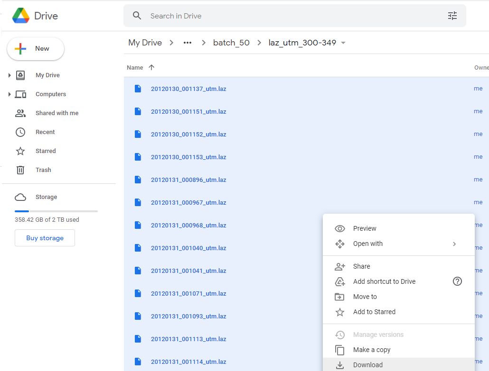

# maryland_rch

Main repository

# Required software

+ CloudCompare
+ QGIS
+ GoogleColab

## Process flow

https://jeffblackadar.github.io/maryland_rch/maryland_rch-lidar.html

## File work areas

There are two file works areas
+ (local drive) local PC: 
```
E:\a_new_orgs\carleton\hist5706-maryland\lidar_files
```
+ (Google Drive) Google Drive: 
```
/content/drive/MyDrive/crane_maryland/
```

### Download files from Google Drive to local drive

There is a constraint that only a 2gb zip file can be downloaded at one time. The .laz files are large so they have been batched into units of 50.
Download each batch.

### Local processing

The local PC has CloudCompare and QGIS installed, these are not available on Google Colab so it's necessary to moved files from Google Drive and process them on a PC and then move them back. Manual tasks but I could not find a better means to process these files using this collection of software.

On the local PC laz files will be converted to DEM using CloudCompare. CloudCompare is not installed on Google Colab so it's used on the local PC.

4 batches of 50 laz files (ex: 0-49, 50-99, 100-149, 150-199) will be downloaed into a folder that can contain 200 files (ex: laz_utm_0-199).

Steps:

1. Create folders to hold downladed files. Example: 
```
E:\a_new_orgs\carleton\hist5706-maryland\lidar_files\reprojected\laz_utm_0-199. 
```

This can be done by running the first cell of 1_1_Maryland_download_laz_tiles_use_CloudCompare_to_convert_to_DEM

2. Manually download the files from Google Drive. Enter the folder and select the files. Verify 50 items selected.
(example):

```
/content/drive/MyDrive/crane_maryland/laz/laz_fema_2012_forested_utm/batch_50/laz_utm_0-49 
```



3. Unzip into directory the appropriate directory to hold 200 files
Extract all

(example) from the zip file of 50 files:

```
E:\a_new_orgs\carleton\hist5706-maryland\lidar_files\reprojected\laz_utm_200-249-20211114T195617Z-001.zip\laz_utm_200-249
```

(example) to the folder to hold a group of 200 files: 
```
E:\a_new_orgs\carleton\hist5706-maryland\lidar_files\reprojected\laz_utm_200-399
```

Download and unzip 4 groups of 50 files into each folder to contain 200 files. Check that the folder has 200 files at the end of each group.

#### CloudCompare

CloudCompare will create a slope shade image file for each .laz. This can be done through CloudCompare's user interface, but to save time, 200 files can be processed one at a time using barch commands. Run CloudCompare commands as a batch using the cell in 1_1_Maryland_download_laz_tiles_use_CloudCompare_to_convert_to_DEM.ipynb

Example: 

```
!"E:\Program Files\CloudCompare\cloudcompare" -SILENT -O E:\a_new_orgs\carleton\hist5706-maryland\lidar_files\reprojected\laz_utm_0-199\20120129_17SQD0990_utm.laz -SET_ACTIVE_SF 8 -FILTER_SF 1.1 2.1 -RASTERIZE -GRID_STEP 1 -EMPTY_FILL INTERP -OUTPUT_RASTER_Z 
```

Change line 11 to the appropriate directory:

Example:
```
input_laz_utm_fp = "E:\\a_new_orgs\\carleton\\hist5706-maryland\\lidar_files\\reprojected\\laz_utm_200-399\\"
```

Run the cell.  It will take several seconds to process each file. Check the directory where the .laz files are. As CloudCompare works, it will create a.bin and a .tif file for each .laz.

#### Quality Assurance 1
In Cell 4, change line 3 to the appropriate folder, for example:
```
batch_group = "400-599"
```
Run Cell 4 Quality Assurance 1

Once all of the local processes are done for a group of 200 files these messages should display:

```
There are:  200  laz files in  E:\a_new_orgs\carleton\hist5706-maryland\lidar_files\reprojected\laz_utm_200-399\
There are:  200  tif files in  E:\a_new_orgs\carleton\hist5706-maryland\lidar_files\reprojected\laz_utm_200-399\dem_tifs\
Both directories have 200 files. This looks good.
```

However, some laz files have a fewer number of scalar fields than others. that means if we process files using CloudCompare where Classification is expected to be at index 8 and it's not at index 8, the process will fail and no tif will be created.

Running Cell 4 Quality Assurance 1 will attempt to fix this by processing files using an index of 6 for scalar field Classfication. If this works, run Cell 3 Copy/Move tifs again to move the generated tifs from this second cycle to the dem_tifs directory. Run Cell 4 Quality Assurance 1 again to recount the files.

#### QGIS: create slope files.

1. Open QGIS
2. Open Python in QGIS
3. Open 1_2_qgis_load_dem_save_as_slope.py and 1_3_qgis_save_slope_tif_as_jpg.py and change batch_group, for example, "400-599".  In 1_2_qgis_load_dem_save_as_slope.py, verify the CRS used, for example, 'EPSG:26918'.
4. Run 1_2_qgis_load_dem_save_as_slope.py This will save the DEM tifs as slope tif files.
5. Run 1_3_qgis_save_slope_tif_as_jpg.py This will save the slope tifs as jpgs.

#### Quality Assurance 2

When done in QGIS run cell 5 Quality Assurance 2 to verify there are 200 files in each of the four directories. These messages should display:

```
There are: 200 laz files in E:\a_new_orgs\carleton\hist5706-maryland\lidar_files\reprojected\laz_utm_200-399\
There are: 200 tif files in E:\a_new_orgs\carleton\hist5706-maryland\lidar_files\reprojected\laz_utm_200-399\dem_tifs\
There are: 200 slope files in E:\a_new_orgs\carleton\hist5706-maryland\lidar_files\slope\slope_200-399\
There are: 200 slope jpg files in E:\a_new_orgs\carleton\hist5706-maryland\lidar_files\slope\slope_200-399\jpgs\
All directories have 200 files. This looks good.
```

#### Copy JPGs to Google Drive
Copy the jpg files to Google drive so they can be used by Mask R-CNN.  Copy E:\a_new_orgs\carleton\hist5706-maryland\lidar_files\slope\slope_200-399/jpgs/ to My Drive/crane_maryland/slope_images/jpgs/


Left off:
200 laz downloaded
E:\a_new_orgs\carleton\hist5706-maryland\lidar_files\reprojected\laz_utm_400-599

laz processing in 400-599


