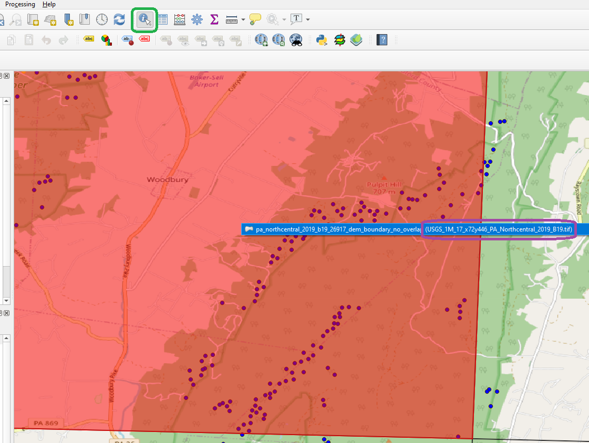
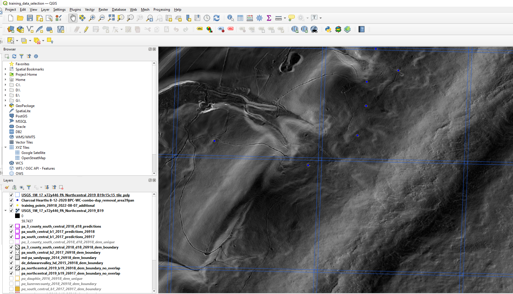

# Training files

The folder to copy is here:
/content/drive/MyDrive/crane_pennsylvania/qgis_retraining_project

The QGIS project is rch_retraining_2022.qgzThe layers are loaded.  For each area, there is a tile grid, dem and slope. I turned off the dem and slope (except for one)
The source files are stored in

dem/

slope/

tile_grid/ - polygons of tiles

training_points/ - points Ben and Weston found plus a file of Jeff's potential points

## Check these points please

G:\My Drive\crane_pennsylvania\qgis_retraining_project\training_points\training_points_26918_2022-08-07_additional_jeff_only.shp

## New points

There are a lot tiles (256 for each slope file), select tiles you'd like to work on.  If you note which points are new, I can pick up which tile you are working on. Or, note the tile.

We are gathering additional training points.

## Google drive
The files are in:

/MyDrive/crane_pennsylvania

If you can map a Google Drive to this the content should open.  My Windows machine maps G:\ to Google drive, so paths look like:

```
G:\My Drive\crane_pennsylvania\pa_michaux_forest_area_rch\training_points_26918_2022-08-07_additional.shp
```

# QGIS
## Project
Open
/MyDrive/crane_pennsylvania/pa_michaux_forest_area_rch/qgis_project/training_data_selection.qgz

### Project layers

#### Charcoal Hearths 8-12-2020 BPC-WC-combo-dup_removal_area39pan.shp
These are the points BJP and WC documented.
```

G:\My Drive\crane_pennsylvania\pa_michaux_forest_area_rch\qgis_project\Charcoal Hearths 8-12-2020 BPC-WC-combo-dup_removal_area39pan\Charcoal Hearths 8-12-2020 BPC-WC-combo-dup_removal_area39pan.shp

```


#### training_points_26918_2022-08-07_additional.shp
These are additional points JB added based on visual inspection of hillshade. They are unconfirmed.
```
G:\My Drive\crane_pennsylvania\pa_michaux_forest_area_rch\training_points_26918_2022-08-07_additional.shp
```

### raw files
#### DEM
MyDrive/crane_pennsylvania/dem

#### slope
These are useful to see what the the terrain looks like to model.

Each large DEM file is a stored as a slope file in a project directory:

/MyDrive/crane_pennsylvania/slope/de_delawarevalley_hd_2015/

Each slope file is tiled into smaller images 640 X 640 and stored in a sub directory 

/MyDrive/crane_pennsylvania/slope/de_delawarevalley_hd_2015/tiles640

Each set of tiles has a shapefile showing the outline.  This is useful to see if all of the RCH in a tile have been noted.

/content/drive/MyDrive/crane_pennsylvania/slope/va_southamptonhenricowmbg_2019_b19/tiles640/polys

#### predictions

each project has a shapefile of predictions, for example:

```
G:\My Drive\crane_pennsylvania\predictions\project_va_northernshenandoah_2020_d20\va_northernshenandoah_2020_d20_predictions_26917.shp
```

The crs for the predictions is 26917 or 26918.  Due to overlap, some projects have prediction files for both crss, load both.

# Project organization
The DEMs are processed by separate LiDAR project. DEMs, slopes and predictions each have a sub directory for each LiDAR project which covers part of a state.

## DEMs from USGS
+ pa_northcentral_2019_b19
+ pa_allentown_2016
+ pa_3_county_south_central_2018_d18"
+ pa_luzernecounty_2018"
+ pa_sandy_2014"
+ pa_south_central_b1_2017
+ pa_south_central_b2_2017
+ pa_dauphin_2016
+ pa_westernpa_2019_d20
+ de_delawarevalley_hd_2015
+ md-pa_sandysupp_2014
+ va_northernshenandoah_2020_d20
+ va_southamptonhenricowmbg_2019_b19
+ va_uppermiddleneck_2018_d18
+ va_fema_r3_northeast_2016
+ va_west_chesapeake_bay_watershed_lidar_2017_b17
+ va_fema_r3_southwest_b_2016
+ va_chesapeakebaysouth_2015

## LAZ from NOAA
+ md_garret_co_2014
+ md_slope_0-199
+ md_slope_200-399
+ md_slope_400-599
+ md_slope_600-999
+ md_slope_1000-1599
+ md_slope_1600-2199

## How to check points

In QGIS, use Identify Features to get a tile's name.  Example: USGS_1M_17_x72y446_PA_Northcentral_2019_B19.tif



Add the vector layer for the shape of the tiles.  Browse to: 

/content/drive/MyDrive/crane_pennsylvania/slope/pa_northcentral_2019_b19/tiles640/polys/USGS_1M_17_x72y446_PA_Northcentral_2019_B19r15c15_tile_poly.shp

Add the raster layer for the slope. Browse to:

```
G:\My Drive\crane_pennsylvania\slope\pa_northcentral_2019_b19\USGS_1M_17_x72y446_PA_Northcentral_2019_B19.tif

```



Please note the tiles you work with so they can be included in the training data while we discard uninspected tiles.

## Predictions
